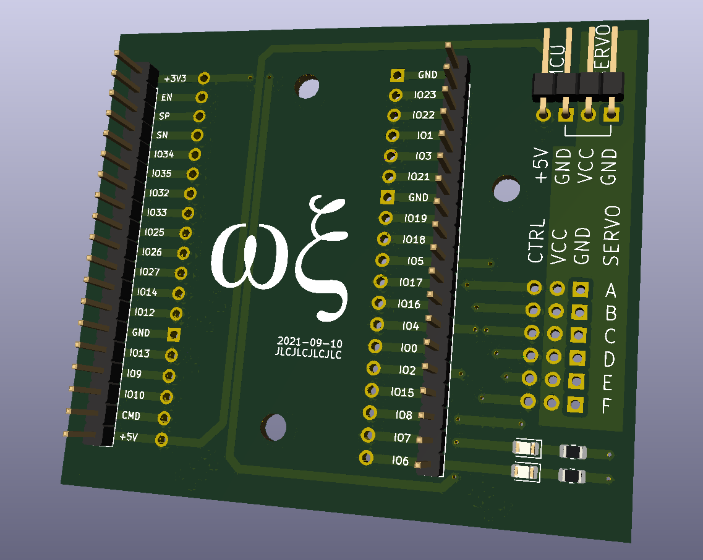

# Wifi Servo Bridge

Sample [firmware](firmware/WifiServoBridge/WifiServoBridge.ino) and
[hardware](hardware/WifiServoBridge) showing of how to utilize ESP32 for driving
servo motors controlled over Wifi.




## Quickstart

```
mc firmware make -C firmware
```

See also [dedicated firmware README](firmware/README.md)


## Usage

* Connect both MCU as well as Servo power to the Wifi Servo Bridge PCB
* Wait until the boot LED is no longer lit up. If the LED starts blinking fast,
  connecting to Wifi causes trouble
* Use the following commands to read and write servo positions. Replace
  `wifi-servo-bridge` with the Wifi Servo Bridge's actual IP (will be displayed
  on serial connection)

```bash
curl -X GET http://wifi-servo-bridge/v1/servo/0		# Read angle of servo 0
curl -X PUT http://wifi-servo-bridge/v1/servo/1/90	# Move servo 0 to angle 90°
curl -X PUT http://wifi-servo-bridge/v1/servo/4/180	# Move servo 4 to angle 180°
curl -X PUT http://wifi-servo-bridge/v1/servo/5/0	# Move servo 5 to angle 0°
```

